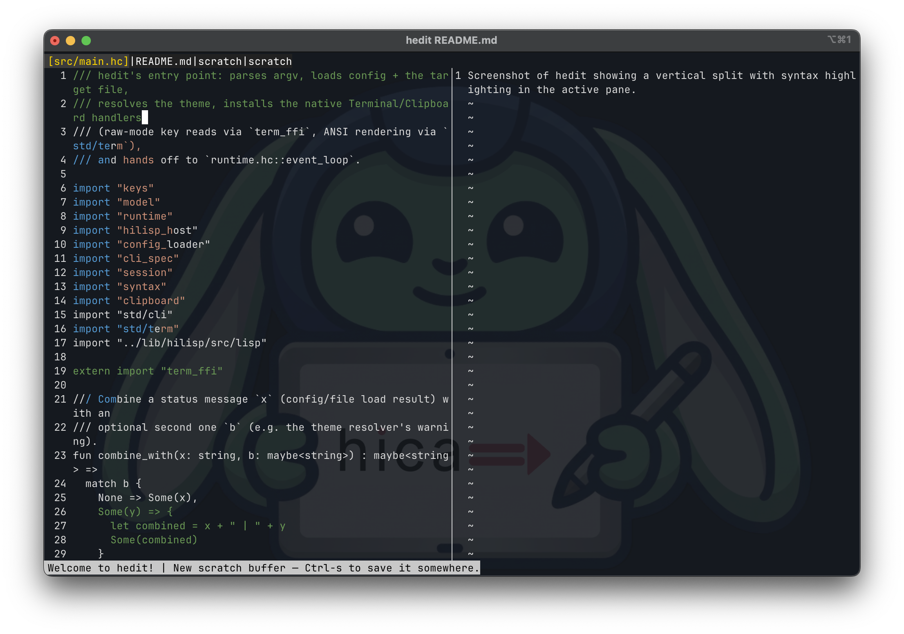

# hedit

`hedit` is a terminal text editor written in [hica](https://www.hica.dev). It
supports multiple buffers, split panes, mouse input, multi-cursor editing,
branching undo, syntax highlighting, session recovery, and HiLisp-based
configuration and plugins.

hedit is also a production workload for hica, exercising algebraic effects,
persistent data structures, native compilation, and C interoperability.

<p align="center">
  
</p>

## Installation

Using `curl`:

```sh
curl -fsSL https://github.com/cladam/hedit/releases/latest/download/install.sh | sh
```

Or using [hicurl](https://github.com/cladam/hicurl):

```sh
hicurl https://github.com/cladam/hedit/releases/latest/download/install.sh | sh
```

Pre-built binaries are available for macOS ARM64, Linux ARM64, and Linux
x86_64. The installer places `hedit` in `~/.local/bin` by default. Override the
location with `HEDIT_INSTALL_DIR`:

```sh
HEDIT_INSTALL_DIR=/usr/local/bin \
  curl -fsSL https://github.com/cladam/hedit/releases/latest/download/install.sh | sh
```

The installer also installs the `hedit(1)` man page. Set `HEDIT_MAN_DIR` to
override its location.

```sh
man hedit
```

Windows is not currently supported.

## Features

### Editing

- **Familiar keybindings** — standard save, open, quit, clipboard, undo, and
  readline-style editing bindings
- **Selections** — keyboard and mouse selection with copy, cut, paste, and
  replacement
- **Multi-cursor editing** — add cursors at matching words or place them with
  the mouse
- **Incremental search** — search as you type and move between wrapping matches
- **Multiple buffers** — a buffer ring with a tabline showing open files
- **Split panes** — horizontal and vertical splits with keyboard and mouse
  focus movement and divider resizing
- **Mouse support** — cursor placement, selection, scrolling, pane focus, and
  split resizing
- **Syntax highlighting** — a built-in line-by-line lexer for hica and Koka

### History and recovery

- **Branching undo tree** — preview and restore historical revisions without
  discarding edits made on other branches
- **Session recovery** — restore open buffers, pane layouts, cursor positions,
  and unsaved scratch buffers
- **Crash recovery** — recover working state after an unexpected exit

### Commands and configuration

- **Command palette** — search and execute editor commands with `Meta-x`
- **Shell commands** — execute commands directly from the command palette
- **Live keybinding overlay** — press `Ctrl-g` to show the active bindings
- **Live configuration reload** — reload settings, bindings, and plugins
  without restarting
- **HiLisp configuration** — configure the editor and write plugins in
  [HiLisp](https://github.com/cladam/hica-lisp)

## Getting started

```sh
hedit                         # restore the previous session, or open a scratch buffer
hedit file.txt                # open a file
hedit +42 file.txt            # open at line 42
hedit +42:8 file.txt          # open at line 42, column 8
hedit --readonly file.txt     # open read-only
hedit --no-recover            # skip session recovery
hedit --help                  # show all command-line options
```

CLI flags override settings loaded from `init.hl`. Other useful flags include
`--tabsize`, `--config`, and `--no-config`.

### Common bindings

| Key | Action |
| --- | --- |
| `Ctrl-s` | Save |
| `Ctrl-o` | Open a file |
| `Ctrl-q` | Quit or close the active pane |
| `Ctrl-f` | Search |
| `Ctrl-z` / `Ctrl-r` | Undo / redo |
| `Ctrl-Space` | Set or clear the selection mark |
| `Meta-c` | Add a cursor at the next match |
| `Meta-v` / `Meta-h` | Open a vertical / horizontal split |
| `Meta-t` | Open the visual undo tree |
| `Meta-x` | Open the command palette |
| `Ctrl-g` | Show the keybinding overlay |
| `Meta-r` | Reload configuration and plugins |

See the [hedit cheatsheet](docs/hedit-cheatsheet.md) for the complete reference,
or press `Ctrl-g` inside hedit.

## Configuration

hedit loads the first configuration file it finds:

1. `$XDG_CONFIG_HOME/hedit/init.hl`
2. `$HOME/.config/hedit/init.hl`
3. `$HOME/.hedit.hl`

Use `--config` to load another file or `--no-config` to skip configuration.

```lisp
;; ~/.config/hedit/init.hl

(set "tabsize" 4)
(set "theme" "ilseon")

(bind "Ctrl-s" 'save)
(bind "Ctrl-q" 'quit)
(bind "Meta-w" 'close-buffer)
```

Press `Meta-r` to reload the configuration without restarting. See
[`examples/init.hl`](examples/init.hl) for the available settings and bindings.

## Plugins

Plugins are regular `.hl` files enabled explicitly from `init.hl`. Plugin paths
are resolved relative to the directory containing that file.

```text
~/.config/hedit/
├── init.hl
└── plugins/
    └── greeter/
        └── plugin.hl
```

Enable the plugin in `init.hl`:

```lisp
(plugin "greeter")
```

Then register hooks in `plugins/greeter/plugin.hl`:

```lisp
(on 'buffer-open
    (fn (path)
        "Welcome to hedit!"))
```

Available hooks are `buffer-open`, `pre-save`, `post-save`, `pre-action`, and
`quit`. Hooks run in registration order. A hook may return a string to update
the status bar. Returning `false` from `pre-save` or `pre-action` cancels the
operation; quit cannot be cancelled.

A missing or broken plugin is reported in the status bar without preventing the
rest of the configuration from loading. See
[`examples/plugins/`](examples/plugins) for examples.

## Implementation

The editor loop resolves terminal events through the active keybindings and
applies the resulting action to `EditorState`:

```text
Event -> Action -> EditorState
```

Terminal input and rendering are defined as a hica effect:

```hica
effect Terminal {
  fun poll_event() : Event
  fun render_frame(buf: ScreenBuffer)
  fun get_dimensions() : (int, int)
  fun set_cursor_style(style: CursorStyle)
}
```

The production handler communicates with the terminal. Tests install a handler
with scripted input and captured frames, allowing the same event loop to be
tested without a TTY.

Undo history is stored as a tree. Editing after an undo creates a new branch
instead of deleting the previous redo path. `Meta-t` opens the tree for
previewing and restoring revisions.

HiLisp is embedded as hedit's configuration and plugin language. Settings,
bindings, and lifecycle hooks all use the same interpreter.

For architecture and development history, see the
[hedit project page](https://cladam.github.io/projects/hedit/) and
[`docs/hedit-design.md`](docs/hedit-design.md).

## Building from source

HiLisp is included as a git submodule:

```sh
git clone --recurse-submodules https://github.com/cladam/hedit.git
cd hedit
hica build -o hedit
```

For an existing clone:

```sh
git submodule update --init --recursive
```

## License

MIT — see [LICENSE](LICENSE).
